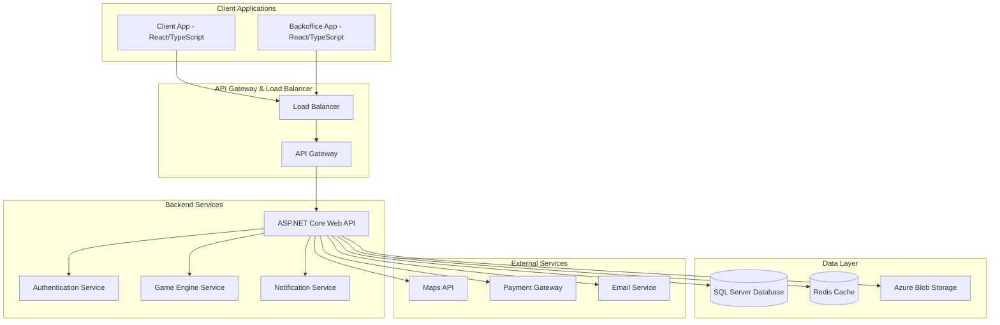

# Design Document: Chanzup Platform

## Overview

The Chanzup Platform is a gamified local rewards system built using modern web technologies. The platform connects small businesses with customers through interactive experiences, featuring Wheel of Luck mechanics and Treasure Hunt campaigns. The system is designed as a multi-tenant SaaS platform with separate interfaces for businesses (backoffice) and players (client app).

### Key Design Principles

- **Multi-tenant Architecture**: Support multiple businesses with isolated data and configurations
- **Scalable and Secure**: Built with enterprise-grade security and horizontal scaling capabilities
- **Mobile-First**: Optimized for mobile devices with responsive web design
- **Real-time Engagement**: Immediate feedback and updates for gamification mechanics
- **Analytics-Driven**: Comprehensive data collection for business insights

## Architecture

### High-Level System Architecture



### Clean Architecture Layers

The backend follows Clean Architecture principles with clear separation of concerns:

1. **Domain Layer**: Core business entities, value objects, and domain services
2. **Application Layer**: Use cases, commands, queries, and application services
3. **Infrastructure Layer**: Database access, external services, and cross-cutting concerns
4. **Presentation Layer**: Web API controllers and DTOs

### Multi-Tenant Strategy

The platform implements a **shared database, shared schema** multi-tenancy model with tenant isolation through:

- **Tenant ID filtering**: All queries automatically filter by tenant (business) ID
- **Row-level security**: Database-level tenant isolation
- **Scoped services**: Tenant context injected into all services
- **Separate configurations**: Per-tenant settings and customizations

## Components and Interfaces

### Core Domain Entities

#### Business Aggregate
- **Business**: Root entity containing business profile and settings
- **Location**: Physical business locations with coordinates and QR codes
- **Staff**: Business employees with role-based permissions
- **Subscription**: Business subscription tier and features

#### Campaign Aggregate
- **Campaign**: Marketing campaigns with game mechanics and rules
- **Prize**: Rewards offered by businesses with inventory tracking
- **GameRule**: Configuration for wheel odds, token costs, and limits
- **PrizeInventory**: Real-time tracking of available prizes

#### Player Aggregate
- **Player**: User accounts with authentication and profile data
- **Wallet**: Player's token balance and transaction history
- **PlayerPrize**: Won prizes awaiting redemption
- **PlayerSession**: QR scanning sessions and location tracking

#### Game Aggregate
- **QRSession**: Individual QR code scanning events
- **WheelSpin**: Wheel of luck game instances with results
- **TokenTransaction**: All token earning and spending activities
- **Redemption**: Prize redemption events and verification

### Application Services

#### Authentication Service
- JWT token generation and validation
- Role-based access control (Admin, BusinessOwner, Staff, Player)
- Multi-factor authentication support
- Session management and refresh tokens

#### Campaign Management Service
- Campaign creation and lifecycle management
- Prize inventory management with real-time updates
- Game rule validation and enforcement
- Campaign analytics and reporting

#### Game Engine Service
- QR code generation and validation
- Wheel spin mechanics with cryptographically secure randomization
- Token economy management
- Anti-fraud detection and prevention

#### Analytics Service
- Real-time metrics collection and aggregation
- Business intelligence dashboards
- Player behavior analysis
- Campaign performance tracking

### External Integrations

#### Maps and Location Services
- Google Maps API for business discovery
- Geolocation verification for QR scanning
- Navigation assistance for players

#### Payment Processing
- Stripe integration for token purchases
- Business subscription billing
- Payout processing for premium features

#### Communication Services
- SendGrid for transactional emails
- Push notifications for mobile engagement
- SMS verification for account security

## Data Models

### Database Schema Design

The database is designed for SQL Server with the following key considerations:
- **Multi-tenant isolation** through tenant ID columns
- **Optimized indexing** for high-frequency queries
- **Audit trails** for all critical operations
- **Referential integrity** with cascading deletes where appropriate

#### Core Tables

**Businesses Table**
```sql
CREATE TABLE Businesses (
    Id UNIQUEIDENTIFIER PRIMARY KEY DEFAULT NEWID(),
    Name NVARCHAR(255) NOT NULL,
    Email NVARCHAR(255) NOT NULL UNIQUE,
    Phone NVARCHAR(50),
    Address NVARCHAR(500),
    Latitude DECIMAL(10,8),
    Longitude DECIMAL(11,8),
    SubscriptionTier INT NOT NULL DEFAULT 0,
    IsActive BIT NOT NULL DEFAULT 1,
    CreatedAt DATETIME2 NOT NULL DEFAULT GETUTCDATE(),
    UpdatedAt DATETIME2 NOT NULL DEFAULT GETUTCDATE(),
    
    INDEX IX_Businesses_Location (Latitude, Longitude),
    INDEX IX_Businesses_Active (IsActive, SubscriptionTier)
);
```

**Players Table**
```sql
CREATE TABLE Players (
    Id UNIQUEIDENTIFIER PRIMARY KEY DEFAULT NEWID(),
    Email NVARCHAR(255) NOT NULL UNIQUE,
    PasswordHash NVARCHAR(255) NOT NULL,
    FirstName NVARCHAR(100),
    LastName NVARCHAR(100),
    Phone NVARCHAR(50),
    TokenBalance INT NOT NULL DEFAULT 0,
    IsActive BIT NOT NULL DEFAULT 1,
    CreatedAt DATETIME2 NOT NULL DEFAULT GETUTCDATE(),
    UpdatedAt DATETIME2 NOT NULL DEFAULT GETUTCDATE(),
    
    INDEX IX_Players_Email (Email),
    INDEX IX_Players_Active (IsActive)
);
```

**Campaigns Table**
```sql
CREATE TABLE Campaigns (
    Id UNIQUEIDENTIFIER PRIMARY KEY DEFAULT NEWID(),
    BusinessId UNIQUEIDENTIFIER NOT NULL,
    Name NVARCHAR(255) NOT NULL,
    Description NVARCHAR(1000),
    GameType INT NOT NULL, -- 0: Wheel of Luck, 1: Treasure Hunt
    TokenCostPerSpin INT NOT NULL DEFAULT 1,
    MaxSpinsPerDay INT NOT NULL DEFAULT 10,
    IsActive BIT NOT NULL DEFAULT 1,
    StartDate DATETIME2 NOT NULL,
    EndDate DATETIME2,
    CreatedAt DATETIME2 NOT NULL DEFAULT GETUTCDATE(),
    UpdatedAt DATETIME2 NOT NULL DEFAULT GETUTCDATE(),
    
    FOREIGN KEY (BusinessId) REFERENCES Businesses(Id) ON DELETE CASCADE,
    INDEX IX_Campaigns_Business (BusinessId, IsActive),
    INDEX IX_Campaigns_Active (IsActive, StartDate, EndDate)
);
```

**Prizes Table**
```sql
CREATE TABLE Prizes (
    Id UNIQUEIDENTIFIER PRIMARY KEY DEFAULT NEWID(),
    CampaignId UNIQUEIDENTIFIER NOT NULL,
    Name NVARCHAR(255) NOT NULL,
    Description NVARCHAR(1000),
    Value DECIMAL(10,2),
    TotalQuantity INT NOT NULL,
    RemainingQuantity INT NOT NULL,
    WinProbability DECIMAL(5,4) NOT NULL, -- 0.0000 to 1.0000
    IsActive BIT NOT NULL DEFAULT 1,
    CreatedAt DATETIME2 NOT NULL DEFAULT GETUTCDATE(),
    UpdatedAt DATETIME2 NOT NULL DEFAULT GETUTCDATE(),
    
    FOREIGN KEY (CampaignId) REFERENCES Campaigns(Id) ON DELETE CASCADE,
    INDEX IX_Prizes_Campaign (CampaignId, IsActive),
    INDEX IX_Prizes_Inventory (RemainingQuantity, IsActive)
);
```

**QRSessions Table**
```sql
CREATE TABLE QRSessions (
    Id UNIQUEIDENTIFIER PRIMARY KEY DEFAULT NEWID(),
    PlayerId UNIQUEIDENTIFIER NOT NULL,
    BusinessId UNIQUEIDENTIFIER NOT NULL,
    LocationLatitude DECIMAL(10,8),
    LocationLongitude DECIMAL(11,8),
    TokensEarned INT NOT NULL DEFAULT 0,
    SessionHash NVARCHAR(255) NOT NULL, -- Prevents replay attacks
    CreatedAt DATETIME2 NOT NULL DEFAULT GETUTCDATE(),
    
    FOREIGN KEY (PlayerId) REFERENCES Players(Id) ON DELETE CASCADE,
    FOREIGN KEY (BusinessId) REFERENCES Businesses(Id) ON DELETE CASCADE,
    INDEX IX_QRSessions_Player (PlayerId, CreatedAt),
    INDEX IX_QRSessions_Business (BusinessId, CreatedAt),
    INDEX IX_QRSessions_Hash (SessionHash)
);
```

**WheelSpins Table**
```sql
CREATE TABLE WheelSpins (
    Id UNIQUEIDENTIFIER PRIMARY KEY DEFAULT NEWID(),
    PlayerId UNIQUEIDENTIFIER NOT NULL,
    CampaignId UNIQUEIDENTIFIER NOT NULL,
    PrizeId UNIQUEIDENTIFIER NULL, -- NULL if no prize won
    TokensSpent INT NOT NULL,
    SpinResult NVARCHAR(50) NOT NULL, -- JSON or enum value
    RandomSeed NVARCHAR(255) NOT NULL, -- For audit trail
    CreatedAt DATETIME2 NOT NULL DEFAULT GETUTCDATE(),
    
    FOREIGN KEY (PlayerId) REFERENCES Players(Id) ON DELETE CASCADE,
    FOREIGN KEY (CampaignId) REFERENCES Campaigns(Id) ON DELETE CASCADE,
    FOREIGN KEY (PrizeId) REFERENCES Prizes(Id),
    INDEX IX_WheelSpins_Player (PlayerId, CreatedAt),
    INDEX IX_WheelSpins_Campaign (CampaignId, CreatedAt)
);
```

### Data Access Patterns

#### Repository Pattern
- Generic repository for common CRUD operations
- Specialized repositories for complex domain queries
- Unit of Work pattern for transaction management

#### Caching Strategy
- **Redis** for session data and frequently accessed lookups
- **In-memory caching** for configuration and static data
- **Cache-aside pattern** with automatic invalidation

#### Performance Optimizations
- **Database indexing** on high-frequency query columns
- **Connection pooling** for database connections
- **Async/await** patterns throughout the application
- **Pagination** for large result sets

## Correctness Properties

*A property is a characteristic or behavior that should hold true across all valid executions of a system—essentially, a formal statement about what the system should do. Properties serve as the bridge between human-readable specifications and machine-verifiable correctness guarantees.*

Now I need to analyze the acceptance criteria to determine which ones can be tested as properties.

### Core Correctness Properties

Based on the requirements analysis, the following properties must hold for all valid system executions:

**Property 1: Account Creation Consistency**
*For any* valid registration data (business or player), creating an account should result in a new account with appropriate default privileges and access to the correct dashboard.
**Validates: Requirements 1.1, 3.1**

**Property 2: QR Code Uniqueness**
*For any* business location setup, generated QR codes should be unique across all businesses and locations in the system.
**Validates: Requirements 1.2**

**Property 3: Input Validation Integrity**
*For any* input data, the system should accept valid inputs and reject invalid inputs according to defined validation rules.
**Validates: Requirements 1.3**

**Property 4: Feature Access Control**
*For any* user account, available features should match the user's subscription tier and role permissions.
**Validates: Requirements 1.5, 8.4, 11.4**

**Property 5: Campaign Lifecycle Management**
*For any* campaign, state transitions (create, activate, pause, resume, end) should be valid and properly reflected in player visibility.
**Validates: Requirements 2.1, 2.5, 2.6**

**Property 6: Prize Inventory Consistency**
*For any* campaign with prizes, the total number of prizes awarded should never exceed the available inventory, and inventory should decrease immediately when prizes are won.
**Validates: Requirements 2.4, 5.4, 5.5**

**Property 7: JWT Authentication Security**
*For any* valid login credentials, the system should generate secure JWT tokens that provide appropriate access to user resources.
**Validates: Requirements 3.2, 3.3**

**Property 8: QR Session Creation and Token Award**
*For any* valid QR code scan at a business location, a session should be created and tokens should be awarded according to campaign rules.
**Validates: Requirements 4.1, 4.3**

**Property 9: Location Verification Integrity**
*For any* QR scan attempt, the system should verify genuine physical presence and reject scans from invalid locations.
**Validates: Requirements 4.2, 12.3**

**Property 10: Anti-Fraud Protection**
*For any* player interaction, the system should prevent replay attacks, enforce cooldown periods, and detect suspicious patterns.
**Validates: Requirements 4.4, 4.5, 12.2, 12.4**

**Property 11: Daily and Weekly Limits Enforcement**
*For any* player, token earning and spending should respect configured daily and weekly limits per business.
**Validates: Requirements 4.6, 7.6**

**Property 12: Wheel Spin Fairness and Integrity**
*For any* wheel spin, the result should be determined by cryptographically secure randomization according to configured odds and available inventory.
**Validates: Requirements 5.2, 5.6, 12.5**

**Property 13: Spin Transaction Atomicity**
*For any* completed wheel spin, tokens should be deducted and prizes awarded atomically according to the spin result.
**Validates: Requirements 5.1, 5.3**

**Property 14: Token Balance Integrity**
*For any* token transaction (earning, spending, purchasing), player token balances should remain accurate and consistent.
**Validates: Requirements 7.1, 7.2, 7.3**

**Property 15: Redemption Workflow Integrity**
*For any* prize redemption, the system should verify prize validity, generate unique codes, prevent duplicate redemptions, and mark prizes as redeemed only once.
**Validates: Requirements 6.1, 6.2, 6.3, 6.4**

**Property 16: Prize Expiration Management**
*For any* won prize, expired prizes should be automatically removed from player wallets according to expiration rules.
**Validates: Requirements 6.6**

**Property 17: Analytics Data Accuracy**
*For any* business analytics request, displayed metrics should accurately reflect actual system activity and be calculated correctly from source data.
**Validates: Requirements 8.1, 8.2, 8.3, 8.5**

**Property 18: Geographic Discovery Accuracy**
*For any* player location, nearby businesses should be displayed accurately based on distance and active campaigns.
**Validates: Requirements 9.1, 9.5**

**Property 19: Multi-Location Business Support**
*For any* business with multiple locations, campaigns can target specific or all locations, and analytics should aggregate correctly across locations.
**Validates: Requirements 11.1, 11.2, 11.3, 11.5**

**Property 20: Administrative Action Audit Trail**
*For any* administrative action, the system should log the action with appropriate details for audit and compliance purposes.
**Validates: Requirements 10.5**

**Property 21: Rate Limiting Protection**
*For any* API endpoint, excessive requests should be blocked according to configured rate limits to prevent automated attacks.
**Validates: Requirements 12.1**

**Property 22: Data Encryption and Access Control**
*For any* sensitive data, the system should encrypt data at rest and in transit, and enforce proper access controls.
**Validates: Requirements 12.6**

## Error Handling

### Error Categories and Strategies

#### Validation Errors
- **Input validation failures**: Return structured error responses with field-specific messages
- **Business rule violations**: Provide clear explanations of rule violations
- **Authentication failures**: Return appropriate HTTP status codes without revealing system details

#### System Errors
- **Database connection failures**: Implement retry logic with exponential backoff
- **External service failures**: Graceful degradation with fallback mechanisms
- **Rate limiting violations**: Return 429 status with retry-after headers

#### Game Mechanics Errors
- **Insufficient tokens**: Clear messaging about token requirements
- **Prize inventory depletion**: Real-time updates to prevent disappointment
- **Location verification failures**: Helpful guidance for proper QR scanning

### Error Response Format

All API errors follow a consistent JSON structure:

```json
{
  "error": {
    "code": "INSUFFICIENT_TOKENS",
    "message": "You need 5 tokens to spin this wheel",
    "details": {
      "required": 5,
      "available": 2,
      "canPurchase": true
    },
    "timestamp": "2024-01-15T10:30:00Z",
    "requestId": "req_123456789"
  }
}
```

### Logging and Monitoring

#### Structured Logging
- **Application logs**: JSON format with correlation IDs
- **Security events**: Separate security log stream
- **Performance metrics**: Response times and resource usage
- **Business events**: Game plays, redemptions, and key user actions

#### Monitoring and Alerting
- **Health checks**: Database, cache, and external service availability
- **Performance monitoring**: API response times and error rates
- **Business metrics**: Daily active users, spin rates, and redemption rates
- **Security monitoring**: Failed authentication attempts and suspicious patterns

## Testing Strategy

### Dual Testing Approach

The Vancouver Rewards Platform requires comprehensive testing using both unit tests and property-based tests to ensure correctness and reliability.

#### Unit Testing
Unit tests will focus on:
- **Specific examples**: Concrete scenarios that demonstrate correct behavior
- **Edge cases**: Boundary conditions like zero token balances, expired campaigns
- **Error conditions**: Invalid inputs, network failures, and system errors
- **Integration points**: API endpoints, database operations, and external service calls

#### Property-Based Testing
Property-based tests will validate universal properties using **fast-check** (JavaScript/TypeScript property testing library):
- **Universal properties**: Rules that must hold for all valid inputs
- **Comprehensive input coverage**: Randomized test data generation
- **Minimum 100 iterations**: Each property test runs at least 100 random cases
- **Requirements traceability**: Each test references its corresponding design property

#### Property Test Configuration
Each property-based test must:
- Run minimum 100 iterations due to randomization
- Reference the specific design document property being tested
- Use the tag format: **Feature: vancouver-rewards-platform, Property {number}: {property_text}**
- Generate realistic test data that respects business constraints

#### Testing Framework Selection
- **Backend**: xUnit for .NET with custom property testing utilities
- **Frontend**: Jest with fast-check for property-based testing
- **Integration**: Testcontainers for database and external service testing
- **End-to-end**: Playwright for full user journey testing

#### Test Data Management
- **Realistic generators**: Smart test data generation that respects business rules
- **Tenant isolation**: Tests run with isolated tenant data
- **Database seeding**: Consistent test data setup and teardown
- **External service mocking**: Controlled responses for external dependencies

The combination of unit tests and property-based tests ensures both specific functionality works correctly and universal business rules are maintained across all possible inputs and scenarios.
## API Design

### Authentication and Authorization

#### JWT Token Structure
```json
{
  "sub": "user-id",
  "email": "user@example.com",
  "role": "BusinessOwner|Player|Admin|Staff",
  "tenantId": "business-id", // For business users
  "permissions": ["campaign:create", "analytics:read"],
  "exp": 1640995200,
  "iat": 1640908800
}
```

#### Role-Based Access Control (RBAC)
- **Admin**: Full system access, user management, platform configuration
- **BusinessOwner**: Full business account access, campaign management, analytics
- **Staff**: Limited business access, redemption verification, basic analytics
- **Player**: Player-specific features, game participation, prize redemption

### Core API Endpoints

#### Authentication Endpoints

**POST /api/auth/register/business**
```json
// Request
{
  "businessName": "Coffee Shop",
  "email": "owner@coffeeshop.com",
  "password": "SecurePass123!",
  "phone": "+1-604-555-0123",
  "address": "123 Main St, Vancouver, BC",
  "subscriptionTier": "basic"
}

// Response
{
  "businessId": "bus_123456789",
  "accessToken": "eyJhbGciOiJIUzI1NiIs...",
  "refreshToken": "rt_987654321",
  "expiresIn": 3600
}
```

**POST /api/auth/register/player**
```json
// Request
{
  "email": "player@example.com",
  "password": "PlayerPass123!",
  "firstName": "John",
  "lastName": "Doe",
  "phone": "+1-604-555-0456"
}

// Response
{
  "playerId": "plr_123456789",
  "accessToken": "eyJhbGciOiJIUzI1NiIs...",
  "refreshToken": "rt_987654321",
  "expiresIn": 3600
}
```

#### Campaign Management Endpoints

**POST /api/campaigns**
```json
// Request
{
  "name": "Holiday Wheel of Fortune",
  "description": "Spin to win holiday prizes!",
  "gameType": "WheelOfLuck",
  "tokenCostPerSpin": 5,
  "maxSpinsPerDay": 3,
  "startDate": "2024-12-01T00:00:00Z",
  "endDate": "2024-12-31T23:59:59Z",
  "prizes": [
    {
      "name": "Free Coffee",
      "description": "One free regular coffee",
      "value": 5.00,
      "quantity": 100,
      "winProbability": 0.3
    },
    {
      "name": "10% Discount",
      "description": "10% off your next purchase",
      "value": 0,
      "quantity": 200,
      "winProbability": 0.5
    }
  ]
}

// Response
{
  "campaignId": "cmp_123456789",
  "qrCode": "data:image/png;base64,iVBORw0KGgoAAAANS...",
  "qrCodeUrl": "https://api.platform.com/qr/cmp_123456789",
  "status": "active"
}
```

**GET /api/campaigns/{campaignId}/analytics**
```json
// Response
{
  "campaignId": "cmp_123456789",
  "period": {
    "startDate": "2024-12-01T00:00:00Z",
    "endDate": "2024-12-31T23:59:59Z"
  },
  "metrics": {
    "totalSpins": 1250,
    "uniquePlayers": 340,
    "prizesAwarded": 875,
    "redemptionRate": 0.72,
    "tokenRevenue": 6250,
    "averageSpinsPerPlayer": 3.68
  },
  "dailyBreakdown": [
    {
      "date": "2024-12-01",
      "spins": 45,
      "uniquePlayers": 23,
      "prizesAwarded": 31
    }
  ]
}
```

#### Game Mechanics Endpoints

**POST /api/qr/scan**
```json
// Request
{
  "qrCode": "cmp_123456789",
  "location": {
    "latitude": 49.2827,
    "longitude": -123.1207
  },
  "timestamp": "2024-12-15T14:30:00Z"
}

// Response
{
  "sessionId": "qrs_987654321",
  "tokensEarned": 10,
  "newBalance": 45,
  "canSpin": true,
  "campaign": {
    "id": "cmp_123456789",
    "name": "Holiday Wheel of Fortune",
    "tokenCostPerSpin": 5,
    "remainingSpinsToday": 2
  }
}
```

**POST /api/wheel/spin**
```json
// Request
{
  "campaignId": "cmp_123456789",
  "sessionId": "qrs_987654321"
}

// Response
{
  "spinId": "spn_456789123",
  "result": "prize",
  "prize": {
    "id": "prz_789123456",
    "name": "Free Coffee",
    "description": "One free regular coffee",
    "redemptionCode": "COFFEE-ABC123",
    "expiresAt": "2024-12-22T23:59:59Z"
  },
  "tokensSpent": 5,
  "newBalance": 40,
  "animation": {
    "duration": 3000,
    "finalAngle": 245.7,
    "segments": [...]
  }
}
```

#### Player Endpoints

**GET /api/player/nearby**
```json
// Query Parameters: ?lat=49.2827&lng=-123.1207&radius=5000

// Response
{
  "businesses": [
    {
      "businessId": "bus_123456789",
      "name": "Coffee Shop",
      "address": "123 Main St, Vancouver, BC",
      "distance": 250,
      "activeCampaigns": 2,
      "location": {
        "latitude": 49.2827,
        "longitude": -123.1207
      },
      "campaigns": [
        {
          "id": "cmp_123456789",
          "name": "Holiday Wheel of Fortune",
          "description": "Spin to win holiday prizes!",
          "tokenCostPerSpin": 5,
          "topPrizes": ["Free Coffee", "10% Discount"]
        }
      ]
    }
  ]
}
```

**GET /api/player/wallet**
```json
// Response
{
  "playerId": "plr_123456789",
  "tokenBalance": 45,
  "prizes": [
    {
      "id": "prz_789123456",
      "name": "Free Coffee",
      "description": "One free regular coffee",
      "businessName": "Coffee Shop",
      "redemptionCode": "COFFEE-ABC123",
      "expiresAt": "2024-12-22T23:59:59Z",
      "isRedeemed": false
    }
  ],
  "recentTransactions": [
    {
      "id": "txn_456789123",
      "type": "earned",
      "amount": 10,
      "description": "QR scan at Coffee Shop",
      "timestamp": "2024-12-15T14:30:00Z"
    }
  ]
}
```

#### Redemption Endpoints

**POST /api/redemption/verify**
```json
// Request
{
  "redemptionCode": "COFFEE-ABC123"
}

// Response
{
  "valid": true,
  "prize": {
    "id": "prz_789123456",
    "name": "Free Coffee",
    "description": "One free regular coffee",
    "value": 5.00,
    "playerName": "John D.",
    "businessName": "Coffee Shop",
    "expiresAt": "2024-12-22T23:59:59Z"
  },
  "canRedeem": true
}
```

**POST /api/redemption/complete**
```json
// Request
{
  "redemptionCode": "COFFEE-ABC123",
  "staffId": "stf_123456789"
}

// Response
{
  "redemptionId": "red_987654321",
  "status": "completed",
  "redeemedAt": "2024-12-15T15:45:00Z",
  "prize": {
    "name": "Free Coffee",
    "value": 5.00
  }
}
```

### API Security Features

#### Rate Limiting
- **Authentication endpoints**: 5 requests per minute per IP
- **Game endpoints**: 10 spins per minute per player
- **QR scanning**: 1 scan per 30 seconds per player per business
- **Analytics endpoints**: 100 requests per hour per business

#### Anti-Fraud Measures
- **Location verification**: GPS coordinates must be within 100m of business
- **Time-based restrictions**: Minimum 30-second cooldown between QR scans
- **Session validation**: QR sessions expire after 10 minutes
- **Replay attack prevention**: Cryptographic session hashes prevent reuse

#### Data Validation
- **Input sanitization**: All inputs validated and sanitized
- **Schema validation**: JSON schema validation for all request bodies
- **Business rule enforcement**: Campaign rules validated at API level
- **Tenant isolation**: All queries automatically filtered by tenant ID

## Security Implementation

### Authentication and Authorization

#### JWT Token Management
- **Access tokens**: Short-lived (1 hour) for API access
- **Refresh tokens**: Long-lived (30 days) for token renewal
- **Token rotation**: Automatic refresh token rotation on use
- **Secure storage**: HttpOnly cookies for web clients, secure storage for mobile

#### Multi-Factor Authentication (MFA)
- **SMS verification**: Required for business account registration
- **Email verification**: Required for all account types
- **TOTP support**: Optional authenticator app integration
- **Backup codes**: Recovery codes for MFA-enabled accounts

#### Role-Based Access Control (RBAC)
```csharp
[Authorize(Roles = "BusinessOwner,Admin")]
[RequirePermission("campaign:create")]
public async Task<IActionResult> CreateCampaign([FromBody] CreateCampaignRequest request)
{
    // Implementation
}
```

### Data Protection

#### Encryption
- **Data at rest**: AES-256 encryption for sensitive database fields
- **Data in transit**: TLS 1.3 for all API communications
- **Key management**: Azure Key Vault for encryption key storage
- **PII encryption**: Personal information encrypted with separate keys

#### Privacy Compliance
- **GDPR compliance**: Right to deletion, data portability, consent management
- **CCPA compliance**: California privacy rights implementation
- **Data minimization**: Collect only necessary personal information
- **Retention policies**: Automatic data purging after retention periods

### Fraud Prevention

#### Location Verification
- **GPS validation**: Verify player location against business coordinates
- **Geofencing**: 100-meter radius validation for QR scanning
- **IP geolocation**: Secondary location verification using IP address
- **Movement patterns**: Detect impossible travel between locations

#### Game Integrity
- **Cryptographic randomness**: Secure random number generation for spins
- **Audit trails**: Complete logging of all game events
- **Inventory tracking**: Real-time prize inventory management
- **Odds verification**: Regular audits of actual vs. configured win rates

#### Abuse Prevention
- **Rate limiting**: Comprehensive rate limiting across all endpoints
- **Behavioral analysis**: Machine learning for suspicious pattern detection
- **Account monitoring**: Automated flagging of unusual activity
- **Manual review**: Admin tools for investigating flagged accounts

## Operational Plan

### Environment Strategy

#### Development Environment
- **Local development**: Docker Compose with SQL Server, Redis, and API
- **Feature branches**: Isolated environments for feature development
- **Integration testing**: Automated testing against containerized services
- **Mock services**: External service mocking for offline development

#### Staging Environment
- **Production mirror**: Identical configuration to production
- **End-to-end testing**: Full user journey testing
- **Performance testing**: Load testing with realistic data volumes
- **Security testing**: Penetration testing and vulnerability scanning

#### Production Environment
- **High availability**: Multi-region deployment with failover
- **Auto-scaling**: Horizontal scaling based on demand
- **Monitoring**: Comprehensive application and infrastructure monitoring
- **Backup strategy**: Automated backups with point-in-time recovery

### Deployment Strategy

#### CI/CD Pipeline
```yaml
# Azure DevOps Pipeline Example
stages:
  - stage: Build
    jobs:
      - job: BuildAPI
        steps:
          - task: DotNetCoreCLI@2
            inputs:
              command: 'build'
              projects: '**/*.csproj'
          - task: DotNetCoreCLI@2
            inputs:
              command: 'test'
              projects: '**/*Tests.csproj'
  
  - stage: Deploy_Staging
    dependsOn: Build
    jobs:
      - deployment: DeployToStaging
        environment: 'staging'
        strategy:
          runOnce:
            deploy:
              steps:
                - task: AzureWebApp@1
                  inputs:
                    azureSubscription: 'Azure-Subscription'
                    appName: 'vancouver-rewards-staging'
                    package: '$(Pipeline.Workspace)/**/*.zip'
  
  - stage: Deploy_Production
    dependsOn: Deploy_Staging
    condition: and(succeeded(), eq(variables['Build.SourceBranch'], 'refs/heads/main'))
    jobs:
      - deployment: DeployToProduction
        environment: 'production'
        strategy:
          runOnce:
            deploy:
              steps:
                - task: AzureWebApp@1
                  inputs:
                    azureSubscription: 'Azure-Subscription'
                    appName: 'vancouver-rewards-prod'
                    package: '$(Pipeline.Workspace)/**/*.zip'
```

#### Database Migration Strategy
- **Entity Framework migrations**: Code-first database schema management
- **Automated migrations**: Staging and production migrations via CI/CD
- **Rollback procedures**: Database rollback scripts for failed deployments
- **Data seeding**: Automated seeding of reference data

#### Blue-Green Deployment
- **Zero-downtime deployments**: Blue-green deployment strategy
- **Health checks**: Automated health verification before traffic switching
- **Rollback capability**: Instant rollback to previous version if issues arise
- **Gradual rollout**: Canary deployments for major releases

### Monitoring and Observability

#### Application Monitoring
- **Application Insights**: Comprehensive application performance monitoring
- **Custom metrics**: Business-specific metrics (spins, redemptions, revenue)
- **Error tracking**: Automatic error detection and alerting
- **Performance monitoring**: Response time and throughput tracking

#### Infrastructure Monitoring
- **Azure Monitor**: Infrastructure health and performance monitoring
- **Log Analytics**: Centralized log aggregation and analysis
- **Alerts**: Proactive alerting for system issues
- **Dashboards**: Real-time operational dashboards

#### Business Intelligence
- **Power BI**: Business analytics and reporting dashboards
- **Data warehouse**: Separate analytics database for reporting
- **ETL processes**: Automated data extraction and transformation
- **Real-time analytics**: Stream processing for live business metrics

This comprehensive design provides a solid foundation for building the Vancouver Rewards Platform with enterprise-grade security, scalability, and maintainability. The architecture supports the MVP requirements while providing a path for future growth and feature expansion.